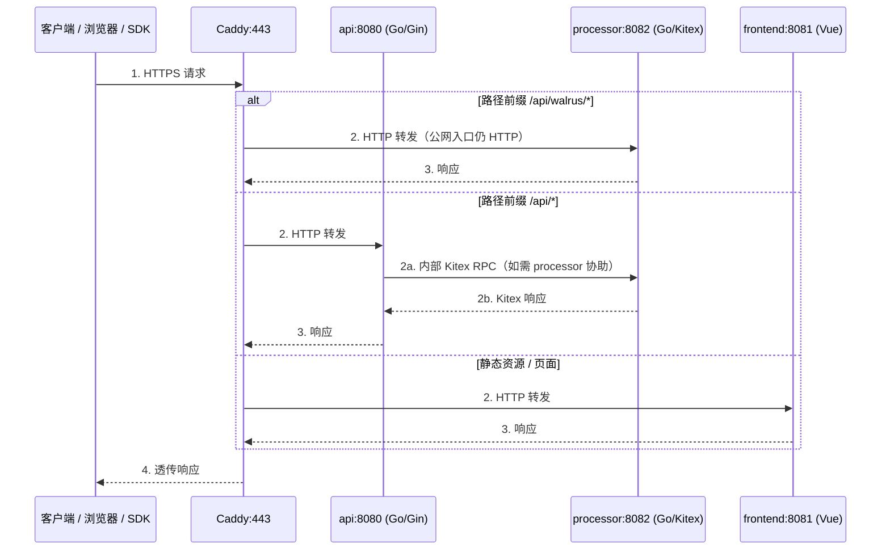
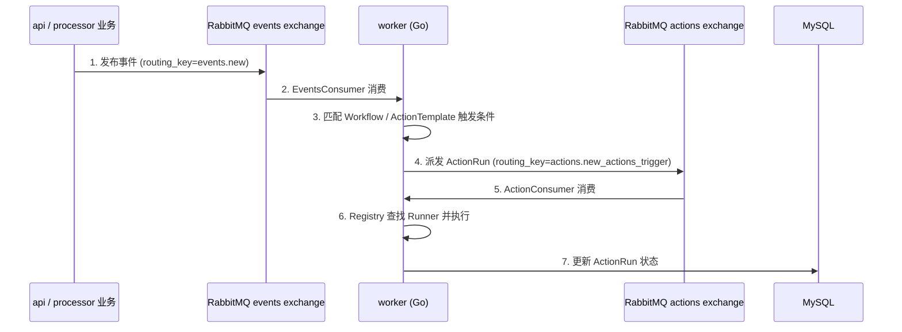

# Diffgram Go 重构设计方案

> 文档日期：2026-05-02
> 范围：Diffgram 后端服务（default / walrus / eventhandlers / local_dispatcher）从 Python 全量重写为 Go
> 决策状态：架构设计稿，待用户 review

---

## 一、目标与决策清单

### 1.1 重构动机

| 动机 | 落地方式 |
|---|---|
| **性能 / 可扩展性** | Go 协程模型替代 Python GIL；MQ 消费者并发可控；hot path 用原生 SQL（必要处）避免 ORM 反射开销 |
| **运维简化** | 每服务编译为单一静态二进制；Docker 镜像基于 distroless；告别 Python 依赖管理痛苦 |
| **生态 / 团队对齐** | 与现有 `tc-label-studio` 项目使用同一套 Go 技术栈，知识与运维经验复用 |

### 1.2 已锁定决策

| 项 | 决策 | 备注 |
|---|---|---|
| 仓库策略 | **新建独立仓库** `diffgram-go` | 不在 monorepo 内共存 |
| 迁移策略 | **Big-bang 重写** | 开源 fork 探索，无生产用户切换压力 |
| 数据库 | **PostgreSQL → MySQL 8.0+** | InnoDB / utf8mb4 |
| API 兼容 | **REST URL 路径 100% 保留** | 现有 Python SDK 与 Vue 前端零改动 |
| 前端 | **Vue 2 + Vuetify 2 保留不动** | 不在本次重构范围 |
| ML 边车 | **接受 ml-runner Python 边车** | 仅承载 Go 无生态对应的 Action（DeepCheck、HuggingFace 本地推理等） |
| 服务间 RPC | **Kitex（Thrift IDL）** | 对齐内部技术栈；公网 API 仍走 HTTP/Gin |
| ORM | **GORM v1.30+** | 对齐 `tc-label-studio` 现有选型 |
| 架构分层 | **DDD 4 层**（interfaces / application / domain / infrastructure） | 镜像 `tc-label-studio` 模式 |

### 1.3 非范围（明确不做）

- Vue 前端重写
- API v2 重新设计（保持 v1 兼容）
- 数据库 schema 重新设计（仅做 PG→MySQL 等价翻译）
- 引入 Kubernetes Operator / Service Mesh
- Python SDK 重写

---

## 二、总体架构

### 2.1 服务拓扑（5 服务 → 3 服务 + 网关）

| 旧 Python 服务 | 新 Go 服务 | 端口 | 职责 |
|---|---|---|---|
| `default` | `api` | 8080 | REST API 主体，对前端与 SDK 暴露 |
| `walrus` | `processor` | 8082 | 重 I/O 与媒体处理（视频、3D、GeoTIFF、Audio） |
| `eventhandlers` | `worker` | 8086 | RabbitMQ 消费 + Action 引擎 + 定时器 |
| `local_dispatcher` | **删除** | — | 由 **Caddy 2** 替代（生产级反向代理，配置 < 30 行） |
| `frontend`（Vue） | **保留** | 8081 | 不动，nginx 容器承载 |
| 新增：`ml-runner` | Python | 8087 | 仅承载无 Go 生态对应的 ML Action（DeepCheck 等） |

### 2.2 请求路由



> **关键点**：公网入口与前端调用仍是 HTTP（保持 SDK 兼容）；服务间内部通信用 Kitex RPC。

### 2.3 事件链路（保持 RabbitMQ 协议 100% 兼容）

5 个 exchange、所有 routing key、queue 名一律保留。这意味着即便选了 big-bang 策略，新旧系统在切换演练期间仍可共用同一个 RabbitMQ broker。



---

## 三、技术栈选型

| 层 | 选型 | 替代谁 | 选型理由 |
|---|---|---|---|
| HTTP 框架 | **Gin** | Flask | 与 `tc-label-studio` 一致；中间件生态广 |
| RPC 框架 | **Kitex（Thrift IDL）** | 内部直连 / HTTP | 与 `tc-label-studio` 一致；强类型 IDL |
| ORM | **GORM v1.30+** + `gorm.io/datatypes` + `gorm.io/hints` | SQLAlchemy | 与 `tc-label-studio` 一致；MySQL 成熟 |
| 数据库迁移 | **goose** | Alembic | SQL-first；MySQL 支持稳定；可读性强 |
| 消息队列客户端 | **rabbitmq/amqp091-go** | pika | RabbitMQ 官方维护；exchange/routing-key 协议保持兼容 |
| 定时器 | **robfig/cron v3** | APScheduler | 标准 cron 表达式，进程内嵌入 |
| 配置 | **koanf** | settings.py | env > yaml 优雅合并；轻量 |
| 日志 | **logrus** | shared_logger | 与 `tc-label-studio` 一致 |
| 鉴权 | **golang-jwt/jwt v5** + **casbin** | 自研 RBAC + Cognito/Keycloak/OIDC | casbin 把现有角色矩阵显式化 |
| 验证 | **go-playground/validator** | regular_input.master | tag-based |
| 对象存储 | AWS SDK v2（S3）+ `cloud.google.com/go/storage`（GCS）+ `azblob`（Azure）+ **minio-go**（MinIO） | data_tools_core*.py | 各家官方 SDK，统一封装 `infrastructure/storage` |
| 缓存（可选） | **go-redis v9** | — | 与 `tc-label-studio` 一致 |
| 测试 | **testify/require** + **testcontainers-go** | pytest + 自建夹具 | testcontainers 自动起 MySQL/RabbitMQ/MinIO |
| 网关 | **Caddy 2** | local_dispatcher | 生产级反向代理；自动 HTTPS |
| 视频/GeoTIFF 处理 | 调用外部 **ffmpeg / GDAL CLI** | 同（Python 也是调外部 CLI） | Go 生态中没有原生替代；走子进程稳妥 |

---

## 四、仓库目录结构（DDD 4 层）

```text
diffgram-go/
├── cmd/                              # 进程入口（仅做依赖装配）
│   ├── api/main.go
│   ├── processor/main.go
│   └── worker/main.go
│
├── interfaces/                       # 入口层
│   ├── http/                         # Gin handler（公网 REST）
│   │   ├── annotation/
│   │   ├── task/
│   │   ├── project/
│   │   ├── auth/
│   │   ├── label/
│   │   └── ...                       # 按 default/methods/ 的 40+ 领域
│   ├── rpc/                          # Kitex Server handler（内部 RPC）
│   │   └── processor_service.go
│   └── consumer/                     # MQ 消费者
│       ├── events.go
│       ├── actions.go
│       ├── jobs.go
│       └── scheduler.go
│
├── application/                      # 用例编排层
│   └── service/
│       ├── annotation_service.go
│       ├── task_service.go
│       ├── project_service.go
│       └── ...
│
├── domain/                           # 领域层（纯业务，零技术细节）
│   ├── entity/                       # 领域实体（对应 94 张表的业务封装）
│   ├── repository/                   # 仓储接口（只定义，不实现）
│   ├── service/                      # 领域服务
│   └── action/                       # ActionRunner 接口 + Registry
│       ├── runner.go
│       └── registry.go
│
├── infrastructure/                   # 基础设施层
│   ├── db/                           # GORM 仓储实现
│   ├── mq/                           # RabbitMQ 客户端封装 + Exchange/Key 常量
│   ├── storage/                      # 4 云对象存储适配
│   │   ├── adapter.go
│   │   ├── s3.go gcs.go azure.go minio.go
│   ├── cache/                        # Redis 客户端
│   ├── auth/                         # JWT / Cognito / Keycloak / OIDC providers
│   ├── permissions/                  # casbin 模型与策略加载
│   ├── action_runners/               # 具体 Runner 实现
│   │   ├── webhook.go
│   │   ├── export.go
│   │   ├── task_template.go
│   │   ├── vertex_ai_object_detection.go
│   │   ├── vertex_train_dataset.go
│   │   ├── azure_text_sentiment.go
│   │   ├── mongodb_text_import.go
│   │   ├── ml_runner_proxy.go        # 转发到 ml-runner 边车的 Runner
│   │   └── ...
│   ├── media/                        # processor 的媒体处理
│   │   ├── image/
│   │   ├── video/                    # ffmpeg-go 包装
│   │   ├── audio/
│   │   ├── pointcloud/
│   │   ├── geotiff/                  # GDAL CLI 包装
│   │   └── text/
│   └── rpc/                          # Kitex Client 封装
│       └── processor_client.go
│
├── idl/                              # Thrift IDL（Kitex 输入）
│   ├── processor.thrift
│   └── common.thrift
├── kitex_gen/                        # Kitex 生成代码（gitignore）
│
├── migrations/                       # goose SQL 迁移
│   ├── 00001_initial_schema.sql      # PG dump → MySQL 翻译版（一次性灌入）
│   └── ...
│
├── api-spec/                         # OpenAPI 3 规范（从 Python endpoints 反推）
├── deployments/
│   ├── docker-compose.yaml
│   ├── Caddyfile
│   ├── ml-runner/                    # Python 边车 Dockerfile
│   └── k8s/                          # 可选 helm chart
├── scripts/
│   ├── pg-to-mysql/                  # 一次性数据迁移工具（Python）
│   └── codegen.sh                    # kitex/goose 生成命令汇总
├── test/
│   ├── integration/                  # testcontainers
│   └── e2e/
├── docs/
├── go.mod / go.sum / Makefile
└── README.md
```

**与 `tc-label-studio` 的对应关系**：4 层命名（interfaces/application/domain/infrastructure）完全一致，新人跨项目零适应成本。

---

## 五、数据层设计 — PG → MySQL

### 5.1 Schema 翻译规则

| PostgreSQL | MySQL 8.0+ | 处理 |
|---|---|---|
| `jsonb`（48 处） | `JSON` | 直接换。对查询热点字段加 **虚拟生成列 + 索引** |
| `integer[]` / `varchar[]`（12 处） | `JSON` 数组 | 默认换 JSON；`member_list`、`annotators_member_list` 这类频繁按元素 join 的考虑升关联表（需 case-by-case 评估） |
| `SEQUENCE`（81 处） | `AUTO_INCREMENT` | 直接对应 |
| `TIMESTAMP`（无 tz） | `DATETIME(6)` | 微秒精度 |
| `BOOLEAN` | `TINYINT(1)` | InnoDB 习惯 |
| `TEXT` / `VARCHAR(n)` | 同名 | 字符集 utf8mb4 / collation utf8mb4_0900_ai_ci |
| `FOREIGN KEY`（332 个） | InnoDB FK | 直接保留 |
| `partial index`（1 处） | 普通索引 + 应用层过滤 | MySQL 不支持 partial index |

### 5.2 数据迁移工具

`scripts/pg-to-mysql/` 是**一次性 Python 脚本**：
- 用 SQLAlchemy 读 PG，PyMySQL 写 MySQL
- 表级别流式迁移（避免一次性加载大表）
- 支持断点续传（迁移进度持久化到 SQLite）
- 不进入运行时镜像，仅 Cutover 阶段执行

### 5.3 GORM 实体定义示例

```go
// domain/entity/task.go
package entity

import (
    "time"
    "gorm.io/datatypes"
)

type Task struct {
    ID          int64          `gorm:"primaryKey;autoIncrement"`
    ProjectID   int64          `gorm:"not null;index"`
    Status      string         `gorm:"size:32;default:'pending';index"`
    Output      datatypes.JSON `gorm:"type:json"`
    TimeCreated time.Time      `gorm:"autoCreateTime"`
    TimeUpdated time.Time      `gorm:"autoUpdateTime"`
}

func (Task) TableName() string { return "task" }
```

### 5.4 Repository 接口与实现（DDD 模式）

```go
// domain/repository/task_repository.go
package repository

import (
    "context"
    "diffgram-go/domain/entity"
)

type TaskRepository interface {
    Create(ctx context.Context, task *entity.Task) error
    QueryByID(ctx context.Context, id int64) (*entity.Task, error)
    QueryByProjectAndStatus(ctx context.Context, projectID int64, status string) ([]*entity.Task, error)
    Update(ctx context.Context, task *entity.Task) error
}
```

```go
// infrastructure/db/task_repo.go
package db

import (
    "context"
    "diffgram-go/domain/entity"
    "gorm.io/gorm"
)

type TaskRepositoryImpl struct{ DB *gorm.DB }

func NewTaskRepository(db *gorm.DB) *TaskRepositoryImpl {
    return &TaskRepositoryImpl{DB: db}
}

func (r *TaskRepositoryImpl) Create(ctx context.Context, t *entity.Task) error {
    return r.DB.WithContext(ctx).Create(t).Error
}
// ... 其他方法
```

> **GORM 仅出现在 `infrastructure/db/`，domain 层只见接口** — 与 tc-label-studio 模式一致。

---

## 六、消息队列与 Action 引擎

### 6.1 RabbitMQ 协议常量（保持 100% 兼容）

```go
// infrastructure/mq/exchanges.go
package mq

const (
    ExchangeActions   = "actions"
    ExchangeEvents    = "events"
    ExchangeExports   = "exports"
    ExchangeJobs      = "jobs"
    ExchangeScheduler = "scheduler"
)

const (
    QueueActionsTriggers = "actions.triggers"
    QueueEventNew        = "event.new"
    QueueJobTasks        = "job.tasks"
    QueueSchedulerTasks  = "scheduler.tasks"
)

const (
    RoutingKeyEventsNew         = "events.new"
    RoutingKeyActionsNewTrigger = "actions.new_actions_trigger"
    RoutingKeyJobsAddTask       = "job.add_task"
    RoutingKeySchedulerAll      = "scheduler.all"
)
```

### 6.2 Action 引擎（Registry 模式）

```go
// domain/action/runner.go
package action

import (
    "context"
    "diffgram-go/domain/entity"
)

type Runner interface {
    Name() string
    Run(ctx context.Context, run *entity.ActionRun) error
}

// domain/action/registry.go
type Registry struct {
    runners map[string]Runner
}

func NewRegistry() *Registry { return &Registry{runners: make(map[string]Runner)} }
func (r *Registry) Register(runner Runner) { r.runners[runner.Name()] = runner }
func (r *Registry) Get(name string) (Runner, bool) {
    runner, ok := r.runners[name]
    return runner, ok
}
```

注册集中在 `cmd/worker/main.go`，新增一个 Runner 等于"实现接口 + 加一行注册"。

### 6.3 ML Runner Sidecar

| Action | 实现位置 | 通信 |
|---|---|---|
| Webhook / Export / TaskTemplate | Go 原生 | — |
| Vertex AI / Azure Text Analytics / MongoDB Import | Go 原生（各家 SDK） | — |
| HuggingFace Zero-shot | Go 原生（调 HuggingFace Inference API） | HTTPS |
| **DeepCheck Image Property Outliers** | **ml-runner Python 边车** | gRPC 或 HTTP |
| 未来 Python 独占 ML 库 | 同上 | 同上 |

`infrastructure/action_runners/ml_runner_proxy.go` 把这些请求转发到 `ml-runner:8087`。Action 注册名与 Python 版一致，业务逻辑无感。

---

## 七、服务间 RPC（Kitex Thrift IDL）

### 7.1 IDL 设计原则

- 一个服务对应一个 `.thrift` 文件
- 公共类型（错误码、分页、用户上下文）放 `idl/common.thrift`
- IDL 是契约：API 改动需先改 IDL → codegen → 双端联调

### 7.2 示例：processor 服务 IDL

```thrift
// idl/processor.thrift
namespace go diffgram.processor

include "common.thrift"

struct ProcessMediaRequest {
    1: required i64 project_id
    2: required string file_url
    3: required string media_type    // image / video / audio / pointcloud / geotiff / text
    4: optional map<string, string> metadata
}

struct ProcessMediaResponse {
    1: required i64 input_id
    2: required string status        // accepted / failed
    3: optional string error_message
}

service ProcessorService {
    ProcessMediaResponse ProcessMedia(1: ProcessMediaRequest req)
    common.PaginatedResponse ListInputs(1: common.PaginationRequest req)
}
```

### 7.3 服务发现

- 单机 / docker-compose：直连 DNS（`processor:8082`）
- 生产 K8s：Kubernetes Service DNS（`processor.diffgram.svc.cluster.local`）
- 不引入 etcd / nacos / consul，保持运维简单

---

## 八、配置 / 日志 / 可观测性

### 8.1 配置加载顺序（koanf）

1. 默认值（代码内嵌）
2. `config.yaml`（如果存在）
3. 环境变量（最高优先级，K8s 友好）

关键环境变量保持与 Python 版兼容：

```text
DATABASE_URL                        # MySQL DSN（替换 PG）
DIFFGRAM_STATIC_STORAGE_PROVIDER    # minio | s3 | gcs | azure
RABBITMQ_HOST / RABBITMQ_PORT
DIFFGRAM_SYSTEM_MODE                # sandbox | testing | production
PROCESSOR_RPC_ADDR                  # api 调 processor 的 Kitex 地址
ML_RUNNER_HTTP_ADDR                 # ml-runner sidecar 地址
SECRET_KEY / FERNET_KEY             # 字段级加密密钥（Fernet 兼容旧数据）
```

### 8.2 日志规范

- Logrus JSON formatter，输出 stdout
- 字段命名与 Python `shared_logger` 对齐：`request_id` / `user_id` / `project_id` / `trace_id`
- HTTP middleware 自动注入 `request_id`
- Kitex middleware 把 `request_id` 通过 metadata 透传

### 8.3 健康检查

| 路径 | 含义 |
|---|---|
| `/api/status` | **保留**，与 Python 版兼容 |
| `/healthz` | 进程存活（liveness） |
| `/readyz` | DB + MQ + 依赖服务可达（readiness） |

### 8.4 可观测性

- **metrics**：Prometheus（`/metrics` 端点）
- **tracing**：OpenTelemetry SDK（可对接 Jaeger / Tempo / 火山引擎 APMPlus）
- **profiling**：`net/http/pprof` 默认开启于 `localhost:6060`

### 8.5 优雅退出

- `signal.NotifyContext(ctx, syscall.SIGTERM, syscall.SIGINT)`
- `errgroup` 协调多 goroutine 关闭
- Worker 模仿 Python 版的"重置运行中 ActionRun 状态"逻辑（避免脏数据）

---

## 九、测试策略

| 层 | 工具 | 覆盖目标 |
|---|---|---|
| 单元测试 | `testing` + `testify/require` | domain / application 服务的纯逻辑 |
| 仓储测试 | `testcontainers-go` 起 MySQL | repository 实现层 SQL 正确性 |
| 集成测试 | testcontainers 起 MySQL + RabbitMQ + MinIO | 端到端用例（上传 → 处理 → 事件 → ActionRun） |
| RPC 测试 | Kitex 内置 mock + 真实 server fixture | 服务间契约 |
| E2E | **复用现有 Cypress** | 前端不变 + API 协议保持 → 大概率直接绿 |

`DIFFGRAM_SYSTEM_MODE=testing` 这个环境变量保留，集成测试时用它短路某些外部依赖（与 Python 版一致行为）。

---

## 十、风险与待决项

| # | 项 | 影响 | 处理 |
|---|---|---|---|
| R1 | Alembic 82 个迁移翻译 | 高 | 不翻译。从当前 PG schema dump → MySQL DDL 作为 `00001_initial_schema.sql`；新迁移用 goose |
| R2 | JSONB → MySQL JSON 索引性能差距 | 中 | 上线前对前 10 个最热查询做 benchmark；必要处加虚拟生成列 + 索引 |
| R3 | Vue 前端的 Cypress E2E 兼容性 | 中 | API 协议不变 → 大概率全绿；失败用例修 selector |
| R4 | `shared/event_emitter` 中的 `NotImplementedError` 过渡代码 | 低 | Go 版直接采用 QueueClient 路径，不复刻 |
| R5 | Python 字段加密 Fernet 与 Go fernet-go 兼容性 | 中 | 实现后用既有 Python 加密样本做反向解密验证 |
| R6 | 内嵌 Python ml-runner 的运维成本 | 中 | 接受。ml-runner 镜像独立维护，与主服务解耦 |
| R7 | 32 个 Python ActionRunner 业务一致性 | 高 | 每个 Runner 翻译后必须做"输入输出对比测试"（同一 ActionRun → Python vs Go 对比 DB 状态） |
| R8 | Vue 2 EOL 持续维护风险 | 低 | 不在本次范围；列入后续 backlog |

---

## 十一、分阶段实施步骤

> 每个 Phase = 一个可交付里程碑。完成判定：能在 docker-compose 跑起来 + 有集成测试 + 能 demo。
>
> **每个 Phase 将由 `superpowers:writing-plans` 单独产出实施计划**，本文档不展开实施细节。

| Phase | 目标 | 关键产出 | 估算（熟练 Go 开发，全职） |
|---|---|---|---|
| **P0. 仓库与基建** | 新仓库可运行 hello world，CI 跑起来 | `diffgram-go` 仓库骨架 / Makefile / docker-compose / GitHub Actions / Caddyfile / Kitex 工具链 | 1 周 |
| **P1. 数据基础** | MySQL schema 落地，数据可从 PG 导入 | `00001_initial_schema.sql`（94 表 MySQL 翻译版） / goose 集成 / `scripts/pg-to-mysql` 跑通一次 / `domain/entity/` GORM 实体 | 2-3 周 |
| **P2. 核心库** | `infrastructure/` 基础设施可用 | config / logger / mq / storage(4云) / auth(JWT) / permissions(casbin) / Kitex Client 封装 / Repository 基类 | 2 周 |
| **P3. 第一个垂直切片** | 端到端跑通：登录 → 创建项目 → 列表项目 | api 服务的 user / project / auth；Vue 前端能登录 | 2 周 |
| **P4. worker 服务** | Action 引擎可运行 | worker cmd / 4 类消费者 / Registry / 5-6 个核心 Runner（Webhook、Export、TaskTemplate、VertexAI）/ ml-runner Python 边车骨架 | 3-4 周 |
| **P5. processor 服务** | 至少图像 + 视频通路跑通 | processor cmd / Kitex IDL / `infrastructure/media/{image,video}` / 上传→存储→DB→事件全链路 | 4-5 周（其余媒体类型继续增量） |
| **P6. 完整 API surface** | 标注 / 任务 / 标签 / 导出全部 endpoint 上线 | 把 `default/methods/` 下所有 endpoint 翻译完，Cypress E2E 全绿 | 6-8 周 |
| **P7. 切换网关 + 部署** | Caddy 替代 dispatcher，生产级部署文档 | Caddyfile / k8s helm chart / 部署手册 / 性能基线 benchmark | 1-2 周 |
| **P8. 老系统下线** | 数据一次性迁移 + Cutover | 迁移演练手册 / 回滚预案 / Python 仓库归档 | 1 周 |

**总估算：21~28 周**（单人全职）。开源 fork 业余推进按精力打折。

**关键 review 节点**：完成 P3 后做一次架构 review（所有"骨架"已立起来，调整成本最低）。

---

## 十二、Open Questions（实施期间需回头确认）

| # | 问题 | 触发时机 |
|---|---|---|
| O1 | 服务发现是否升级到 etcd / nacos？ | P7 部署阶段 |
| O2 | 是否引入 OpenTelemetry Collector 还是直推 APM？ | P2 基础设施期 |
| O3 | ml-runner 边车与 worker 通信用 gRPC 还是 HTTP？ | P4 worker 实施前 |
| O4 | 是否需要为高并发标注场景引入读写分离？ | P6 性能 benchmark 后决定 |
| O5 | Cypress E2E 是否需要为新后端调整 fixtures？ | P3 起持续验证 |

---

## 附录 A：与 `tc-label-studio` 的镜像对照

| 维度 | `tc-label-studio` | `diffgram-go`（本方案） |
|---|---|---|
| 架构分层 | DDD 4 层 | 完全一致 |
| HTTP 框架 | Gin | Gin |
| RPC | Kitex | Kitex |
| ORM | GORM | GORM |
| 日志 | Logrus | Logrus |
| 缓存 | Redis | Redis（可选） |
| 数据库 | MySQL | MySQL |
| MQ | 自有抽象 | RabbitMQ（兼容老协议） |
| 对象存储 | TOS（火山） | S3 / GCS / Azure / MinIO（开源多云） |

新人在两个项目间切换的认知负担接近零。

---

_文档基于 `master` 分支最近提交 `56f04d87` 与 `diffgram_complete_schema.sql`（94 表）梳理。技术栈或决策有调整时请同步本文档。_
